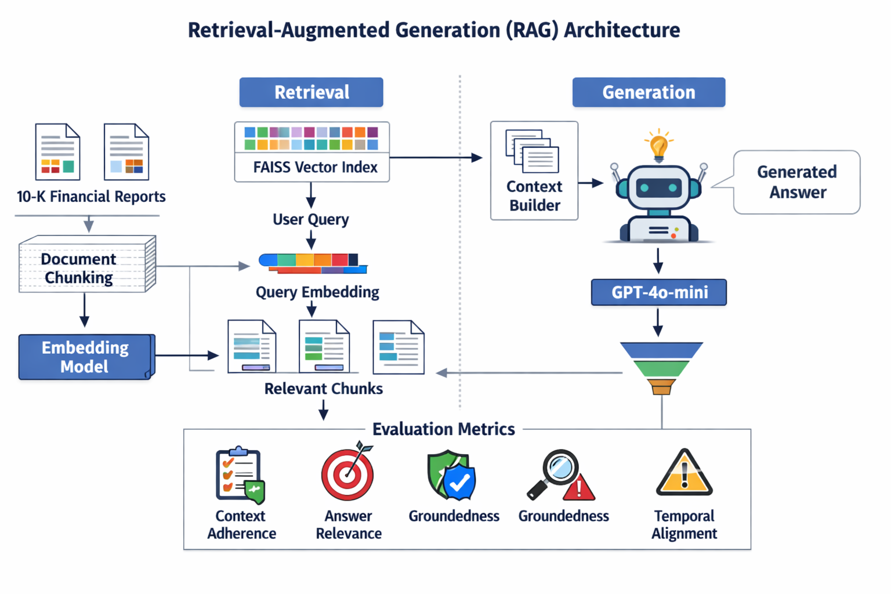

# 📚 AdvanceRAG -- Baseline Chunking Experiment

A structured Retrieval-Augmented Generation (RAG) baseline experiment
built using:

-   LangChain
-   FAISS (local persistent vector store)
-   sentence-transformers/all-MiniLM-L6-v2 embeddings
-   gpt-4o-mini for answer generation
-   LLM-as-Judge evaluation framework
-   Windows local environment

------------------------------------------------------------------------

# 🎯 Objective

Build and evaluate a baseline RAG system that:

1.  Extracts and chunks PDFs
2.  Creates a vector-based retrieval system
3.  Generates answers grounded in retrieved context
4.  Evaluates answer quality using LLM-as-judge
5.  Produces structured evaluation metrics

------------------------------------------------------------------------

# 🧠 Architecture Overview

PDFs → Chunking → Embeddings → FAISS → Retrieval
Retrieval → Context + Question → gpt-4o-mini → Answer
Answer → LLM-as-Judge → Evaluation Metrics

------------------------------------------------------------------------

# 📂 Dataset

  Source                           Type
  -------------------------------- -------------------------------
  NVIDIA 10-K                      Financial document
  Microsoft 10-K                   Financial + Business document
  AWS Well-Architected Framework   Cloud Architecture Whitepaper

Total PDFs: 3
Chunk size: 1000
Chunk overlap: 200

------------------------------------------------------------------------

# 🪓 1️⃣ PDF Extraction & Chunking

Method: - Extract text from PDFs - Apply recursive character splitting -
Chunk size: 1000 - Overlap: 200

Observation: Chunk size 1000 reduced context precision due to large
financial tables.

------------------------------------------------------------------------

# 🔎 2️⃣ Retrieval Layer

Embedding Model: sentence-transformers/all-MiniLM-L6-v2

Vector Store: FAISS (locally persisted)

------------------------------------------------------------------------

# ✨ 3️⃣ Answer Generation

LLM used: gpt-4o-mini

Input: - User Question - Top-k Retrieved Chunks

Prompt Strategy: - Strictly answer from context - Avoid hallucination -
Say "I don't know" if answer absent

------------------------------------------------------------------------

# 📊 4️⃣ Evaluation Framework (LLM-as-Judge)

Metrics Used:

1.  Context Adherence
2.  Context Precision
3.  Answer Relevance
4.  Groundedness

------------------------------------------------------------------------

# 📈 Evaluation Results Summary

From 21 evaluated questions:

-   Context Adherence: ~76%
-   Context Precision: Moderate (~0.48 avg)
-   Answer Relevance: Strong (~0.74 avg)
-   Groundedness: High (except temporal mismatch cases)

------------------------------------------------------------------------

# 🔎 Key Observations

Strengths: 
- Retrieval surfaces correct financial tables 
- Most answers grounded in context - Low hallucination rate

Failure Modes: 
- Temporal misalignment in multi-year tables 
- Conservative "I don't know" responses 
- Low precision due to large chunk size

------------------------------------------------------------------------

# 🚀 Improvement Roadmap

-   Reduce chunk size to 600--800
-   Add year-alignment guardrails
-   Add table-aware prompting
-   Add hybrid retrieval or reranking

------------------------------------------------------------------------

# 🏗 Tech Stack

-   LangChain
-   FAISS
-   sentence-transformers/all-MiniLM-L6-v2
-   gpt-4o-mini
-   Python
-   Windows local environment

------------------------------------------------------------------------

# 📌 Baseline System Maturity

Retrieval: ⭐⭐⭐⭐☆
Generation: ⭐⭐⭐⭐☆
Grounding: ⭐⭐⭐⭐☆
Precision: ⭐⭐⭐☆☆
Temporal Robustness: ⭐⭐☆☆☆

Overall: 7.5 / 10 Baseline RAG

------------------------------------------------------------------------

# 👨‍💻 Author

AdvanceRAG experimentation series focusing on evaluation-first RAG
architecture design.
