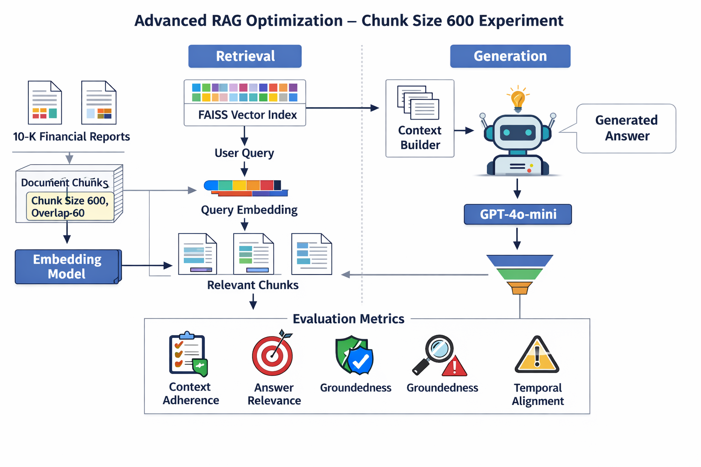

# 📚 Advanced RAG Optimization — Chunk Size 600 Experiment

This repository contains experiments focused on improving Retrieval-Augmented Generation (RAG) performance by tuning chunking parameters.

Branch: `base_chunk_600`
Location: `Baseline_Chunking/`

---

# 🎯 Objective

Improve RAG answer quality and retrieval precision by optimizing:

* **Chunk Size:** 600 tokens
* **Chunk Overlap:** 60 tokens

The hypothesis was that smaller, more semantically focused chunks would:

* Reduce irrelevant context retrieval
* Improve answer relevance
* Improve context precision
* Maintain groundedness

------------------------------------------------------------------------

# 🧠 Architecture Overview

PDFs → Chunking → Embeddings → FAISS → Retrieval
Retrieval → Context + Question → gpt-4o-mini → Answer
Answer → LLM-as-Judge → Evaluation Metrics



------------------------------------------------------------------------


# ⚙️ Experiment Setup

| Parameter            | Baseline                | Improved             |
| -------------------- | ----------------------- | -------------------- |
| Chunk Size           | Default (larger chunks) | **600 tokens**       |
| Chunk Overlap        | Default                 | **60 tokens (~10%)** |
| Embedding Model      | Same                    | Same                 |
| LLM                  | Same                    | Same                 |
| Evaluation Framework | Same                    | Same                 |

All other variables were kept constant to isolate the impact of chunking strategy.

---

# 📊 Evaluation Metrics

We evaluated using the following RAG quality metrics:

* **Groundedness** — Are claims supported by context?
* **Context Adherence** — Does answer rely on retrieved context?
* **Context Precision** — Is retrieved context relevant?
* **Answer Relevance** — Does answer directly address the question?

---

# 📈 Results Comparison

| Metric            | Baseline | Chunk 600  | Improvement |
| ----------------- | -------- | ---------- | ----------- |
| Groundedness      | 0.7619   | 0.7460     | −0.0159     |
| Context Adherence | 0.8095   | **0.8476** | +0.0381     |
| Context Precision | 0.4571   | **0.4762** | +0.0190     |
| Answer Relevance  | 0.6982   | **0.7448** | +0.0466     |


Note : Detailed result of each question can be found <a href="https://github.com/TechTrojan/AdvanceRAG/tree/base_chunk_600/Baseline_Chunking/eval_result">here</a>

---

# 🔎 Observations

### 1️⃣ Groundedness

Slight decrease (−0.016), statistically negligible.
No meaningful increase in hallucination rate.

### 2️⃣ Context Adherence ↑

Improved reliance on retrieved context.

### 3️⃣ Context Precision ↑

Cleaner retrieval with reduced irrelevant financial tables.

### 4️⃣ Answer Relevance ↑ (Largest Gain)

Improved semantic matching and fewer vague responses.

---

# 🧠 Why Chunk Size 600 Works Better

Financial documents (10-K filings, risk disclosures, etc.) often contain:

* Large structured tables
* Repeated headings
* Dense financial data

Large chunks:

* Introduce noise
* Reduce embedding discrimination
* Increase irrelevant retrieval

Smaller chunks (600 tokens):

* Improve semantic targeting
* Increase embedding granularity
* Reduce context dilution
* Improve answer focus

---

# 📌 Key Takeaway

Chunk size **600 with 60 overlap** improves overall RAG performance for structured financial documents.

The increase in:

* Context Adherence
* Context Precision
* Answer Relevance

outweighs the negligible drop in groundedness.

---

# 🚀 Recommended Configuration

For SEC filings and structured reports:

```
chunk_size = 600
chunk_overlap = 60
```

Suggested tuning range:

* Chunk Size: 500–800
* Overlap: 10–15%

---

# 🧪 Future Improvements

* Test chunk size 500 vs 700
* Evaluate impact of dynamic chunking
* Try semantic chunking instead of fixed window
* Test hybrid retrieval (BM25 + vector)
* Add reranking layer

---

# 📂 Repository Structure

```
Baseline_Chunking/
├── ingestion.py
├── retrieval.py
├── evaluation.py
├── configs/
├── results/
└── README.md
```

---

# 📖 Reference

Chunk size 600 implementation:
https://github.com/TechTrojan/AdvanceRAG/tree/base_chunk_600/Baseline_Chunking

---

# 👨‍💻 Author

Experiment conducted to optimize RAG parameter tuning for structured enterprise documents.

---
