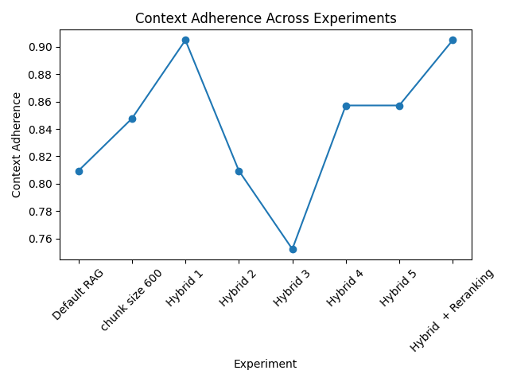
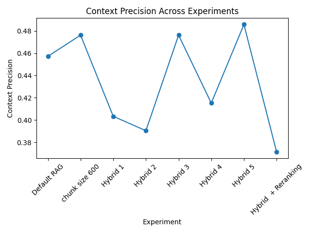
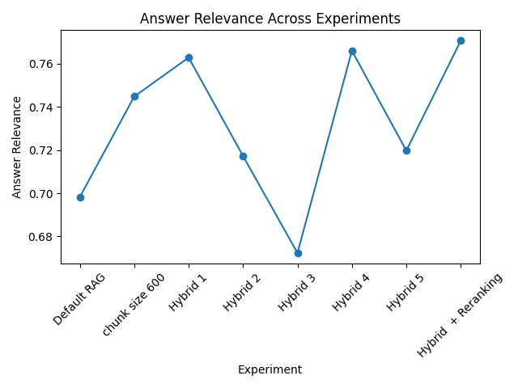
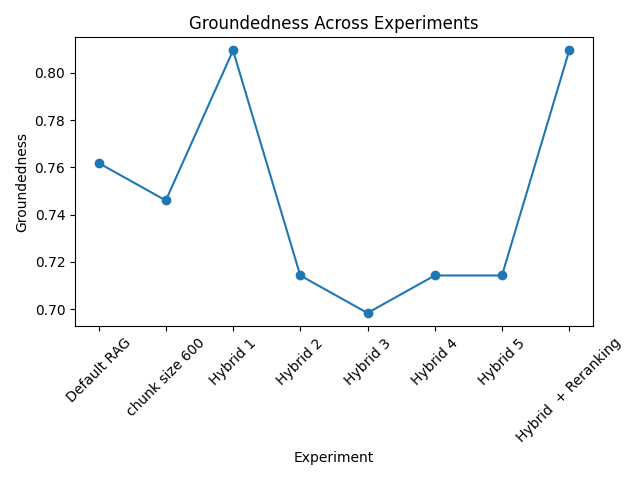

# 📊 Advanced RAG Evaluation Study

This repository presents a structured evaluation of multiple Retrieval-Augmented Generation (RAG) optimization strategies.

---

# 🔬 Experiments Evaluated

1. Default RAG  
2. Chunk Size Optimization  
3. Overlap Optimization  
4. Hybrid Retrieval  
5. Hybrid + CrossEncoder Reranking  
6. Weight Tuning  
7. Top-K Variation  

---

# 📈 Evaluation Parameters

| Metric | Description |
|--------|------------|
| Context Adherence | Measures how closely the answer relies on retrieved context |
| Context Precision | Measures relevance quality of retrieved chunks |
| Answer Relevance | Measures alignment between answer and question |
| Groundedness | Measures factual support traceability in context |

---

# 📊 Context Adherence Comparison

Insight:
Hybrid + Reranking shows the strongest improvement in adherence, indicating better context utilization.

---

# 📊 Context Precision Comparison

Insight:
Hybrid retrieval improves recall but slightly reduces precision — a classic recall–precision tradeoff.

---

# 📊 Answer Relevance Comparison

Insight:
Chunk optimization and hybrid + reranking significantly improved question–answer alignment.

---

# 📊 Groundedness Comparison

Insight:
Hybrid + CrossEncoder Reranking produced the most stable grounding performance across experiments.

---

# ⚖ Performance Insights

- Chunk optimization improves semantic alignment.
- Overlap improves contextual continuity but may introduce redundancy.
- Hybrid retrieval increases recall.
- CrossEncoder reranking improves ranking quality and grounding.
- Weight tuning controls precision–recall balance.
- Top-K impacts stability and retrieval noise.

---

# 🤖 Implication for Agentic Systems

For AI agents and multi-step reasoning workflows:

- Retrieval quality directly impacts reasoning reliability.
- Better grounding reduces hallucinated intermediate steps.
- Hybrid + reranking provides the most stable retrieval foundation for production-grade agent systems.

---

# 🎯 Final Recommendation

1. Start with chunk optimization.
2. Add hybrid retrieval for recall.
3. Introduce CrossEncoder reranking for ranking quality.
4. Tune weights and Top-K carefully.
5. Always evaluate groundedness — not just precision.

Evaluation-first RAG design leads to architecturally sound AI systems.

