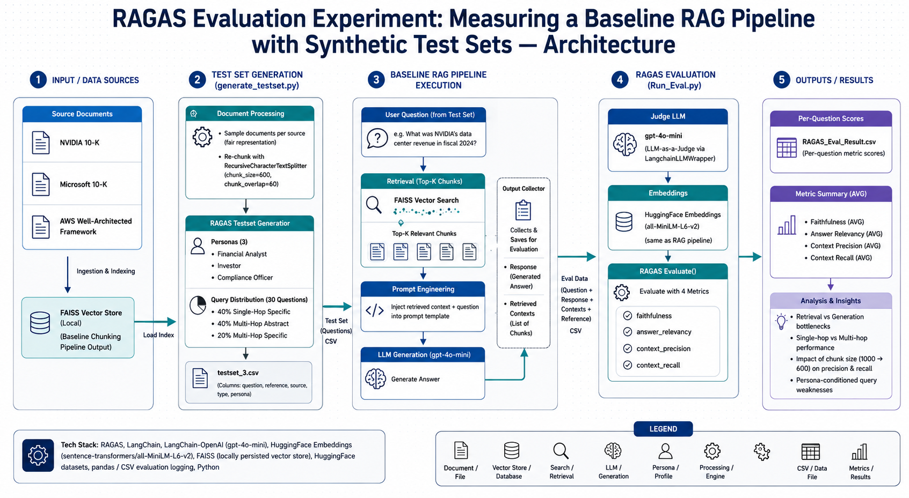

# 📏 RAGAS Evaluation Experiment: Measuring a Baseline RAG Pipeline with Synthetic Test Sets

## 📌 Overview

You can't improve a RAG system you haven't measured.

In this experiment, I built an end-to-end evaluation harness around the **Baseline Chunking** RAG pipeline using the **RAGAS** framework — generating a synthetic test set from the same documents the RAG system retrieves over, then scoring the pipeline's answers against that test set.

The goal was to move from "the answers look reasonable" to **quantified RAG quality** across:

- Faithfulness
- Answer Relevancy
- Context Precision
- Context Recall

---

## 🎯 Objective

To build a reproducible RAGAS evaluation loop that:

- Generates synthetic Q&A pairs from a FAISS-indexed document corpus
- Feeds those questions through the baseline RAG pipeline to collect responses + retrieved contexts
- Scores the pipeline with RAGAS metrics
- Produces a CSV results file we can compare across future chunking / retrieval experiments

---

## 🧠 What is RAGAS?

RAGAS (Retrieval-Augmented Generation Assessment) is a framework for evaluating RAG pipelines using **LLM-as-judge** metrics. Instead of hand-labelling thousands of question/answer pairs, RAGAS:

1. **Synthesizes** a test set directly from your own documents
2. Generates a mix of **single-hop** and **multi-hop** questions
3. Optionally conditions queries on **personas** (e.g. Financial Analyst, Investor, Compliance Officer)
4. Scores the RAG pipeline using metrics that separate **retrieval quality** from **generation quality**

### Example:

**Source corpus:** NVIDIA 10-K, Microsoft 10-K, AWS Well-Architected Framework

**RAGAS-generated questions:**
- *Single-hop specific*: "What was NVIDIA's data center revenue in fiscal 2024?"
- *Multi-hop abstract*: "How do Microsoft's cloud growth narrative and NVIDIA's AI hardware story reinforce each other?"
- *Multi-hop specific*: "Which AWS Well-Architected pillar maps most directly to the risk factors disclosed in Microsoft's 10-K?"

👉 The pipeline is then judged on whether its answers stay grounded and whether retrieval surfaced the right chunks.

---

## ⚙️ Tech Stack

- RAGAS
- LangChain
- LangChain-OpenAI (`gpt-4o-mini`)
- HuggingFace Embeddings (`sentence-transformers/all-MiniLM-L6-v2`)
- FAISS (locally persisted vector store)
- HuggingFace `datasets`
- pandas / CSV evaluation logging
- Python

---

## 🧠 Architecture Diagram

  

---

## 🧪 Experiment Design

The RAGASEvaluation folder contains three scripts that form a clean **generate → collect → evaluate** pipeline:

### 1️⃣ `generate_testset.py` — Synthetic Test Set Generation

- Loads the FAISS index built by the Baseline Chunking pipeline
- Samples documents **per source** (so every PDF is represented fairly)
- Re-chunks with `RecursiveCharacterTextSplitter` (`chunk_size=600`, `chunk_overlap=60`)
- Defines three personas: **Financial Analyst, Investor, Compliance Officer**
- Generates 30 synthetic questions with a query distribution of:
  - 40% `SingleHopSpecificQuerySynthesizer`
  - 40% `MultiHopAbstractQuerySynthesizer`
  - 20% `MultiHopSpecificQuerySynthesizer`
- Exports the test set to `testset_3.csv`

### 2️⃣ `build_eval_data.py` — Eval Dataset Loader

- Reads `testset_3.csv` (now enriched with the pipeline's `response` and `retrieved_contexts`)
- Safely parses the `retrieved_contexts` column using `ast.literal_eval` (CSV-safe list parsing)
- Returns a HuggingFace `Dataset` shaped exactly as RAGAS expects:
  `user_input`, `response`, `retrieved_contexts`, `reference`

### 3️⃣ `Run_Eval.py` — RAGAS Scoring

- Wraps `gpt-4o-mini` as the **judge LLM** via `LangchainLLMWrapper`
- Uses the same local `all-MiniLM-L6-v2` embeddings as the RAG pipeline
- Runs `ragas.evaluate(...)` with four metrics:
  - **faithfulness**
  - **answer_relevancy**
  - **context_precision**
  - **context_recall**
- Saves per-question scores to `RAGAS_Eval_Result.csv`

---

## 📊 Key Evaluation Focus

### 🔹 Faithfulness
Does the generated answer stay grounded in the retrieved context, or does it hallucinate?

### 🔹 Answer Relevancy
Does the answer actually address the question asked?

### 🔹 Context Precision
Of the chunks the retriever returned, how many were actually relevant?

### 🔹 Context Recall
Of the chunks that *should* have been retrieved, how many did we actually surface?

Together, **precision + recall** isolate retrieval quality, while **faithfulness + relevancy** isolate generation quality — so failures can be diagnosed to the right layer.

---

## 🔍 Expected Insights

This evaluation harness is designed to reveal:

- Is retrieval the bottleneck, or is the LLM hallucinating on good context?
- Do multi-hop questions degrade faster than single-hop ones?
- Do persona-conditioned queries surface chunking weaknesses (e.g. financial tables)?
- How much does chunk size (1000 → 600) shift precision and recall?
- Where does the baseline RAG actually break — and which fix is highest-leverage?

---

## 💡 Why This Matters

In real-world GenAI systems, **evaluation is architecture**.

The difference between:
- A pipeline that "seems to work"
vs
- A pipeline with measurable faithfulness, precision, and recall

is the difference between a demo and a production system.

This becomes especially relevant for:

- Enterprise document Q&A (10-Ks, contracts, policies)
- Regulated domains (finance, healthcare, legal)
- Multi-document agentic workflows
- Any RAG system that will be iterated on more than once

---

## 🚀 Trade-Offs

### RAGAS Advantages:
- Reproducible, automated scoring
- Separates retrieval failures from generation failures
- Synthetic test sets scale with your corpus, not your labelling budget
- Persona + multi-hop synthesis stress-tests the pipeline beyond easy questions

### Possible Costs:
- LLM-as-judge introduces its own bias (mitigated by `temperature=0`)
- Synthetic questions can be easier than real user questions
- Generation cost scales with `TESTSET_SIZE × metrics × judge calls`
- Requires careful handling of `retrieved_contexts` serialization in CSV

---

## 📂 File Reference

| File | Purpose |
|------|---------|
| `generate_testset.py` | Build synthetic Q&A test set from FAISS via RAGAS `TestsetGenerator` |
| `build_eval_data.py`  | Load enriched CSV into a RAGAS-ready HuggingFace `Dataset` |
| `Run_Eval.py`         | Run RAGAS metrics and export `RAGAS_Eval_Result.csv` |

---

## 📎 Repo

https://github.com/TechTrojan/AdvanceRAG/tree/Base_RAGAS/Baseline_Chunking/src/RAGASEvaluation

---

## 🎯 Final Thought

This experiment isn't just about scoring a RAG pipeline.

It's about building the **feedback loop** that makes every subsequent RAG improvement — better chunking, hybrid retrieval, reranking, table-aware prompting — provable rather than anecdotal.

👉 Sometimes better RAG doesn't come from a better model…
but from a better way to **measure** what the model is doing.
